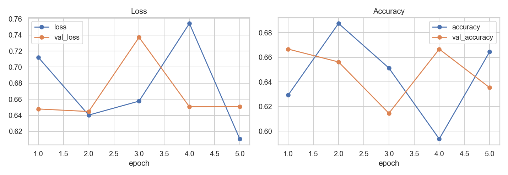
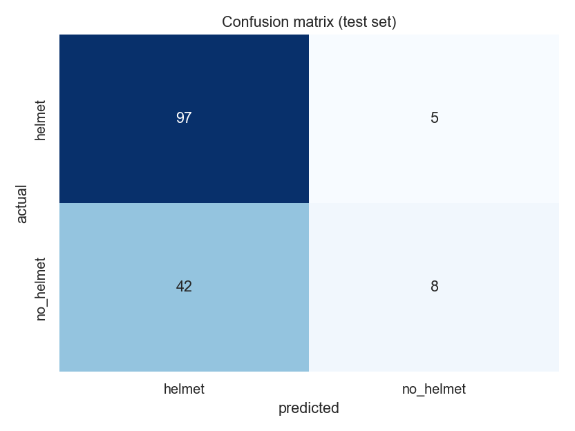

# Helmet Detection (image classification)

A small CNN that looks at a photo of a rider and answers one question: **is the rider wearing a helmet?** It is one of my first deep-learning projects (written in December 2024 while learning TensorFlow / Keras). The model and training code are kept as I originally wrote them; this folder adds a reproducible data pipeline, a proper evaluation and documentation.

## Result

Evaluated on a held-out test set of 152 images (80 / 20 split, fixed seed), with the original model and the original training setup.

| | |
|---|---|
| Test accuracy | **69.1%** (105 / 152) |
| Majority-class baseline (always "helmet") | 67.1% |
| ROC-AUC | 0.66 |
| Recall on `helmet` / `no_helmet` | 95% / **16%** |

**In plain words: the model is barely better than guessing "helmet" every time.** It misses most riders without a helmet, which is the case that matters. The notebooks of the original run (`notebooks/train_model.ipynb`, `notebooks/evaluate_model.ipynb`) recorded 62.5% test accuracy; the exact split of that run was not saved, so this folder re-creates it from the public data with a fixed seed. I kept the weak result on purpose, as an honest starting point: the *Conclusions* section of [`notebooks/analysis.ipynb`](notebooks/analysis.ipynb) explains what limits it.

| Training curves | Confusion matrix |
|---|---|
|  |  |

The model is mostly undecided (many predictions close to 0.5) and training does not settle, see [`results/mistakes.png`](results/mistakes.png) for examples of its errors.

## Dataset

The **Bikes Helmets** dataset (Make ML): **764 photos of motorcycle and bicycle riders**, annotated with Pascal VOC boxes labelled "With Helmet" / "Without Helmet". It is available on Kaggle as [`andrewmvd/helmet-detection`](https://www.kaggle.com/datasets/andrewmvd/helmet-detection) (listed there as public domain) and mirrored on Hugging Face as [`cute-face/bike-helmet-dataset`](https://huggingface.co/datasets/cute-face/bike-helmet-dataset) (CC BY 4.0). The images are **not** included in this repository (about 400 MB).

The classifier needs one label per image, so `scripts/prepare_data.py` labels an image `no_helmet` if it contains at least one "Without Helmet" box and `helmet` otherwise (3 images without any box are dropped). This gives 761 images: 497 `helmet` (65%) and 264 `no_helmet` (35%).

## Getting started

```bash
pip install -r ../../requirements.txt
```

**1. Download the data** (about 400 MB) into `data/raw` (or download it from Kaggle and place it in `data/raw/helmet_voc/{images,annotations}`):

```python
from huggingface_hub import snapshot_download
snapshot_download("cute-face/bike-helmet-dataset", repo_type="dataset",
                  allow_patterns=["helmet_voc/*"], local_dir="data/raw")
```

**2. Build the image folders** (80 / 20 train / test split):

```bash
python scripts/prepare_data.py
```

**3. Train and evaluate**: run [`notebooks/analysis.ipynb`](notebooks/analysis.ipynb) (about 2 minutes on a CPU). It trains the model, evaluates it, writes `results/` and saves `models/helmet_detection_model.h5`.

**4. Use the trained model**:

```bash
python scripts/test.py                               # accuracy on the test folder
python scripts/inference.py path/to/image.png        # helmet / no helmet for one image
```

## Files

| Path | Description |
|---|---|
| `models/model.py` | The CNN: 3 × (Conv + MaxPool), Dense 128, Dropout 0.5, sigmoid output |
| `scripts/train.py` | Data generators (80 / 20 train / validation split of the training folder) |
| `scripts/test.py`, `scripts/inference.py` | Evaluate on the test folder / classify a single image |
| `scripts/prepare_data.py` | Builds `data/helmet_detection/{train,test}/{helmet,no_helmet}` from the annotations |
| `notebooks/data_preprocessing.ipynb`, `train_model.ipynb`, `evaluate_model.ipynb` | My original notebooks with their recorded outputs |
| `notebooks/analysis.ipynb` | Reproducible training run and evaluation (baseline, confusion matrix, errors) |
| `models/helmet_detection_model.h5` | Weights from the run documented above (45 MB) |
| `results/` | Metrics, plots and the exact train / test split |

The original scripts and notebooks only had their hard-coded absolute paths replaced by relative ones; the model and training code are unchanged. `scripts/test.py` additionally re-compiles the loaded model (the saved weights file has no optimizer state). Note that its original `steps = samples // 32` only evaluates the first 128 of the 152 test images, so it prints 69.5% instead of the 69.1% of the notebook, which uses all images.

## Future work

- Class weights or balanced sampling, data augmentation, more epochs
- Transfer learning from a pretrained backbone (e.g. MobileNetV2)
- An object detector (e.g. YOLO) trained on the per-rider boxes, which matches the annotations better than one label per image
- Per-rider evaluation instead of per-image labels
