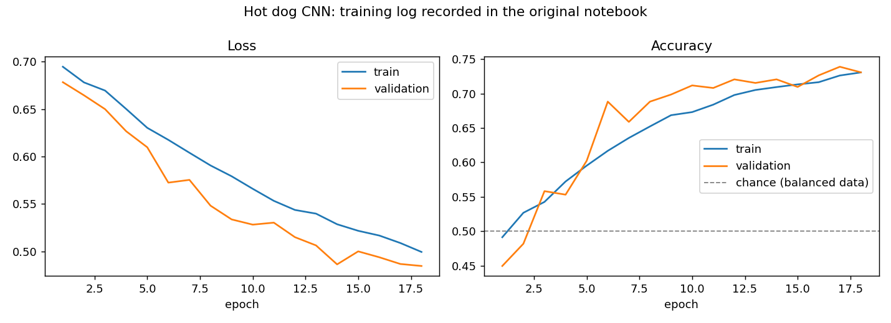

# Hot dog / not hot dog (CNN)

Binary image classification with a convolutional neural network: is the food in the picture a hot dog?

| | |
|---|---|
| **Data** | [Food-101](https://data.vision.ee.ethz.ch/cvl/datasets_extra/food-101/) (Bossard et al., 2014), loaded through TensorFlow Datasets (`food101`, 4.65 GiB download, **not included** in this repository). Class 55 is "hot dog", everything else is "not hot dog". |
| **Task** | Binary image classification |
| **Skills** | TensorFlow / Keras, CNNs, `tf.data` pipelines, class balancing, data augmentation |

## Files

| File | Description |
|---|---|
| `Hot_dog_Project.ipynb` | Original notebook, with the training outputs it recorded |
| `plot_training_curves.py` | Parses the saved training log from the notebook's output and plots it. It does not train anything |
| `training_curves.png` | Output of the script |

## Approach (from the notebook)

1. Resize images to 128×128 and turn the 101-class labels into hot dog / not hot dog.
2. Hot dogs are a small fraction of the data, so the hot-dog class is repeated and both classes are sampled 50/50 to get a balanced stream.
3. Model: rescaling → random flip and rotation (augmentation) → 3 × Conv2D(128) with max-pooling and dropout → Dense(128) → 1 output unit. Adam, learning rate 1e-4, binary cross-entropy.

## Results

The saved log covers **18 of the 50 planned epochs** (about 19 minutes each on CPU). Validation accuracy rose from 45% to **73% (best 73.9%)** on balanced data, where chance is 50%. Train and validation curves stay close together and are still improving, so this run stopped before convergence. It shows no overfitting gap in the recorded epochs.

## Possible next steps

Transfer learning from a pretrained backbone (e.g. MobileNetV2 or EfficientNet) would likely reach much higher accuracy in a fraction of the training time; adding a confusion matrix and misclassified examples would complete the evaluation. Re-running requires the Food-101 download and `requirements.txt`.
